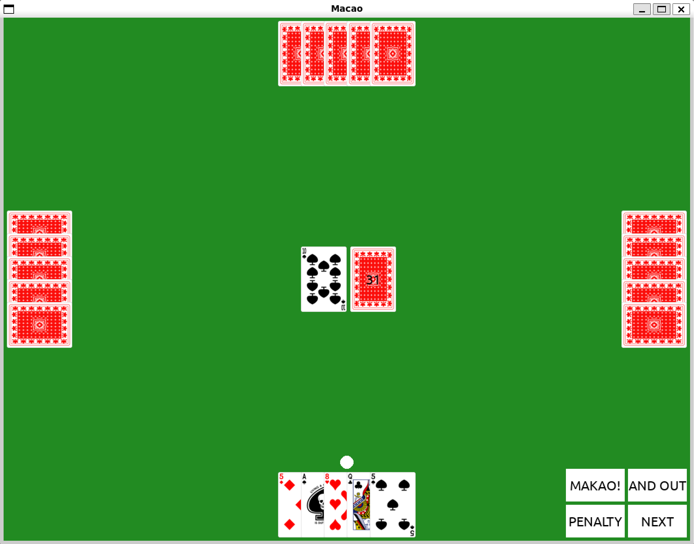
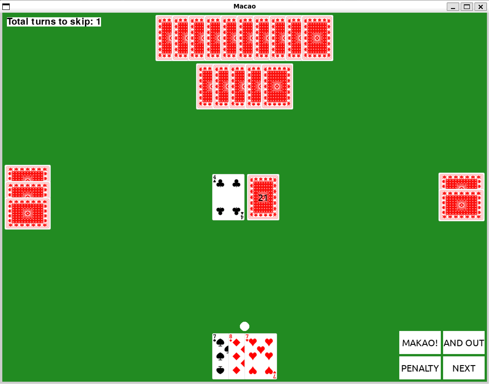
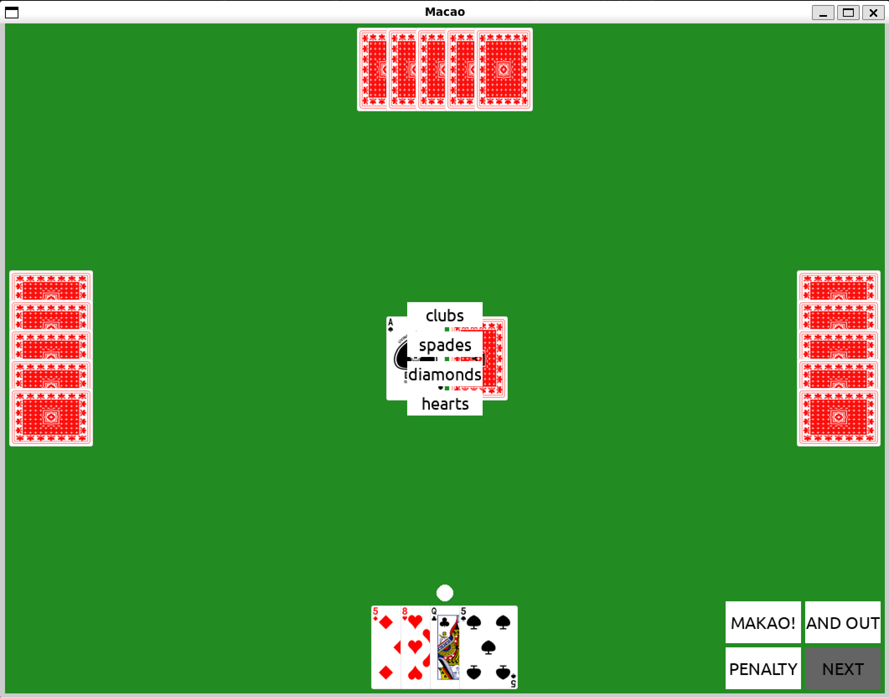
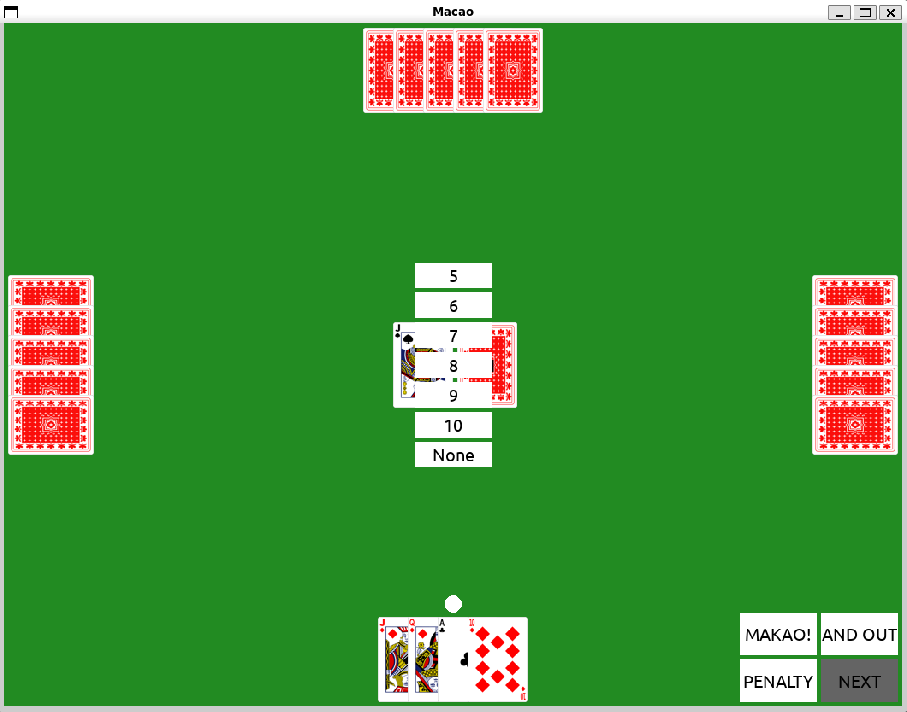

# Damian D'Souza - Macao project

## Table of Contents

- [Name](#name)
- [Description](#description)
- [Installation](#Install and run program)
- [Usage](#usage)
- [License](#license)

## Name
Macao

## Description

Macao is a popular card game, this project is based on its Polish rules. The game is played with a standard deck of 52 cards and can be played by 2 to 4 players. The objective of the game is to be the first player to get rid of all your cards.

Each player is dealt five cards at the start of the game. The remaining cards form the draw pile, with the top card turned face up to start the discard pile. Players take turns playing a card that matches the rank or suit of the top card of the discard pile. If a player cannot play a card, they must draw a card from the draw pile. If the player can play the drawn card, they may do so, otherwise, they must keep the card and end their turn. Functional cards (2, 3, 4, W, D, K, A) have special effects, which are described below.

 - **2♠ 2♥ 2♣ 2◆ 3♠ 3♥ 3♣ 3◆**: the next player draws two/three cards (depending on the number of pips). In the case where the next player also has a two/three, they can lay it down, thus forcing the subsequent player to pick up the sum of the values of the cards (where the next player can also play a two/three, and so on). In the worst-case scenario, a player might have to draw 29 cards (four twos [8 cards] + four threes [12 cards] + 3 jokers for threes [9 cards]).

- **4♠ 4♥ 4♣ 4◆**: the next player skips one turn. To defend against this, you must play another four, then the number of skipped turns accumulates and affects the next player in line. Functional cards do not work on a blocked player (the effect is applied to the next player in line).

- **W♠ W♥ W♣ W◆ (J♠ J♥ J♣ J◆)**: the player can request cards based on their face value (only non-functional cards). It is not allowed to play a queen using the rule "queen for everything, everything for the queen." The request for a specific card by a jack applies for the entire subsequent turn (including the player who played the jack) and can only be changed by playing another jack (overriding the request to a different card or not requesting any card).

- **D♠ D♥ D♣ D◆**: the "queen for everything, everything for the queen" rule means the possibility of laying down a queen on any card, regardless of color and value (sometimes: unless the card prevents it because it is functional) and placing any card on a laid queen. Additionally, in some versions, the rule D♠ (or also D♥) applies, preventing the action of biting kings or all functional cards.

- **K♥ K♠**: these are two kings that cause the previous (**K♠**) or next (**K♥**) player to draw five cards, depending on the color of that king. To defend against such a king, you must play another king (the cards add up, resulting in the attacker drawing 10 cards), and **K♥ K♠** can be blocked by non-biting kings **K♣ K◆**.

- **A♠ A♥ A♣ A◆**: the player can demand a change of color (changing the color by an ace affects the next player, not the entire queue of players, as in the case of a jack). Sometimes, you can defend against this by laying down more than one card of the same value, for example, three fives (the last logically being of a different color) or laying down another ace and changing the color to a different one. In some variants, this rule does not apply to queens.

The game continues until a player has no cards left. For more detailed rules, please refer to the [Polish Wikipedia page](https://pl.wikipedia.org/wiki/Makao_(gra_karciana)).

## Visuals

  
  

  
  

## Install and run program
1. Clone the repository: `git clone https://gitlab-stud.elka.pw.edu.pl/ddsouza/makao-projekt-pipr-damian-dsouza`
2. Navigate to the project directory: `cd makao-projekt-pipr-damian-dsouza`
3. Create a venv and activate it:
    - Linux:
        - `python3 -m venv .venv`
        - `source venv/bin/activate`
        - If there is `UserWarning: 'fc-list' is missing on your system.` you can fix it using `sudo apt-get install fontconfig` and it should fix rendered text issues.
    - Windows:
        - `python -m venv .venv`
        - `venv\Scripts\activate`
4. Install the required packages: `pip install -r requirements.txt`
5. Run the game: `python game.py [num_players]`

## Code description
- Card class: represents a single card, has a value, suit and effect that's assigned based on it's value and suit
- Deck class: represents a deck of cards, has a list of cards and methods to shuffle, draw and add cards to the deck, there can never be two cards with the same value and suit in the deck. Deck can be empty or unshuffled based on user needs.
- HumanPlayer class: represents a player, has a list of cards and methods to draw, play and add cards to the player's hand.
- ComputerPlayer class: represents a computer player it inherits beasic methods from HumanPlayer. The computer player has a simple AI that decides which card to play based on the current card, and game parameters.
- Game class: represents a game, has a list of players, a deck, a discard pile and a current card. The game has methods to start, play and end the game

## What was achieved
-Working game for 2-4 players, with a simple AI for computer players. The game has a simple UI that allows the user to play the game and see the current state of the game.
-Ability to signal "Makao!" and "Makao and out!", computer can signal stop makao which can make user draw 5 cards if makao wasn't signaled
-Thoroughout the game user can see the current state of the game: center card, number of cards in deck cards are drawn from, number of cards in each player's hand, in terminal there is also move history (what card was in the center, played card and player that played it)
-After game is over list with every player's rank is shown.

## Things to improve

- Optimize AI strategy to work faster on larger set of cards, currently it can get slower when player has around 15 cards. Add option to track all cards played in game to imporve decison making, and predict what cards other players have.
- Optimize game rendering, currently entire game is rendered every frame, this can be improved by only rendering the parts that change.